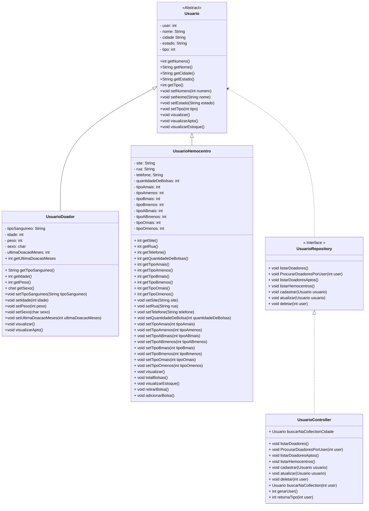

# Projeto JaVai Doar Sangue
### Descrição

O sistema desenvolvido tem por objetivo facilitar a conexão entre hemocentros e doadores de sangue, além de fazer um gerenciamento de estoque para hemocentros. O projeto foi realizado finalizando o bloco de Java avançado da Generation Brasil.

*Diagrama das Classes:* 

### Funcionalidade

No sistema há todas as funções **CRUD** (Create, Read, Update, Delete) tanto para doadores quanto para hemocentros, também há funções específicas como verificar quais são os doadores aptos na doação de sangue para os hemocentros seguindo as informações inseridas no cadastro dos usuários doadores.

### Tecnologias

 	<code></code> 	<code></code> 	<code></code> 

### Como acessar

1. Antes de começar, certifique-se de ter instalado o seguinte:

- Java SDK
- IDE de sua preferência, foi usado: Spring Tool Suite ou Eclipse.

2. Pegue o projeto com o comando `git clone` para seu servidor local.

3. Importe o projeto para o IDE.
4. Execute (Run) na Classe Principal *Menu.java* e observe o projeto no Console.
